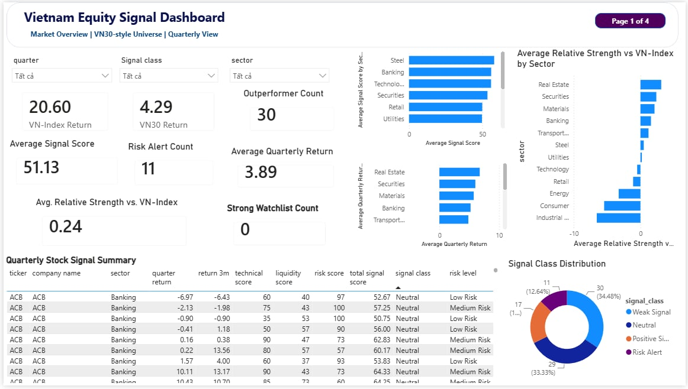
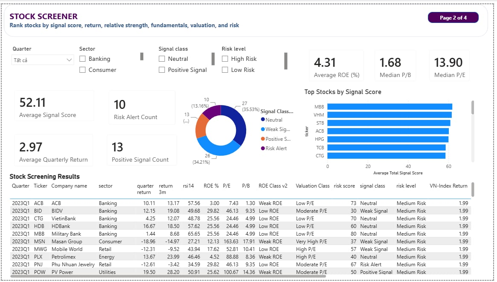
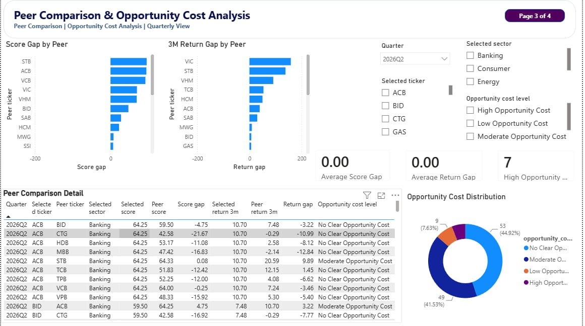
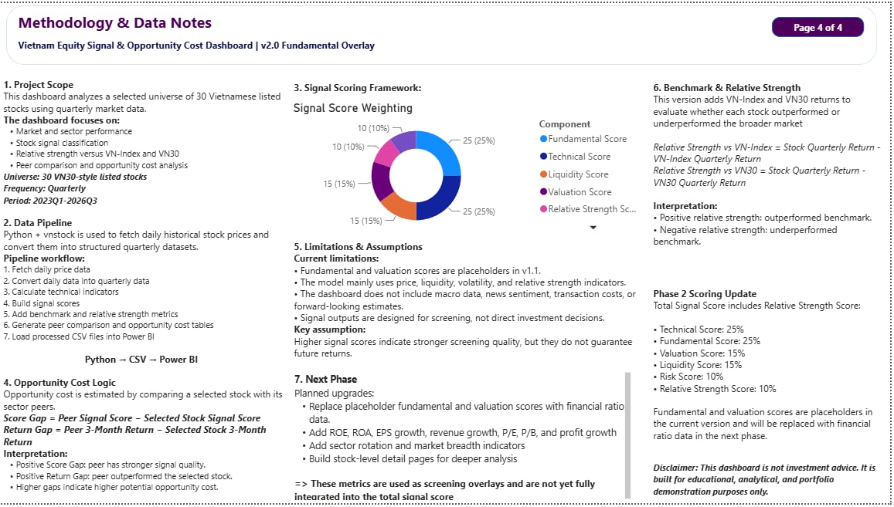

# Vietnam Equity Signal Dashboard

## 1. Project Overview

This project presents a Power BI dashboard for Vietnam equity signal screening, relative strength analysis, peer comparison, and opportunity cost monitoring.

The dashboard combines a Python-based data pipeline with Power BI visualization to analyze a VN30-style universe of 30 Vietnamese listed stocks on a quarterly basis.

Version 2.0 adds a fundamental and valuation overlay using ROE, P/E, and P/B as latest available snapshot indicators.

---

## 2. Objectives

The project aims to:

- Build a Python-to-Power BI workflow for Vietnam equity market analysis.
- Analyze stock-level signal strength using technical, liquidity, risk, and relative strength indicators.
- Compare stock performance against VN-Index and VN30 benchmarks.
- Identify sector-level outperformers and underperformers.
- Compare selected stocks with sector peers to assess opportunity cost.
- Add ROE, P/E, and P/B as fundamental and valuation overlay indicators for stock screening.

---

## 3. Dashboard Pages

### 3.1 Market Overview

This page provides a high-level view of market performance, benchmark returns, sector relative strength, signal class distribution, and quarterly stock signal summary.

---

### 3.2 Stock Screener

This page ranks stocks by signal score, return, relative strength, fundamentals, valuation, and risk.

Version 2.0 adds Average ROE, Median P/E, Median P/B, ROE Class, and Valuation Class.

---

### 3.3 Peer Comparison & Opportunity Cost Analysis

This page compares selected stocks with sector peers using signal score gaps, 3-month return gaps, and opportunity cost classification.

---

### 3.4 Methodology & Data Notes

This page explains the data pipeline, scoring framework, relative strength logic, opportunity cost methodology, limitations, and next development phase.

---

## 4. Data Pipeline

The project uses Python to process market data and prepare CSV files for Power BI.

Pipeline workflow:

1. Fetch historical stock price data.
2. Convert daily price data into quarterly data.
3. Calculate technical indicators.
4. Build stock signal scores.
5. Add VN-Index and VN30 benchmark returns.
6. Calculate relative strength versus benchmarks.
7. Generate peer comparison and opportunity cost tables.
8. Add ROE, P/E, and P/B as fundamental and valuation snapshot indicators.
9. Load processed CSV files into Power BI.

---

## 5. Key Features

- VN30-style universe of 30 Vietnamese listed stocks
- Quarterly stock return analysis
- VN-Index and VN30 benchmark comparison
- Relative strength versus VN-Index and VN30
- Technical signal scoring
- Liquidity and risk scoring
- Signal class distribution
- Peer comparison by sector
- Opportunity cost classification
- ROE, P/E, and P/B fundamental valuation overlay
- Power BI dashboard with four analytical pages

---

## 6. Methodology

### 6.1 Signal Score Framework

The total signal score is based on six components:

- Technical Score: 25%
- Fundamental Score: 25%
- Valuation Score: 15%
- Liquidity Score: 15%
- Risk Score: 10%
- Relative Strength Score: 10%

In Version 2.0, ROE, P/E, and P/B are added as supplementary screening indicators. These metrics are not yet fully integrated into the total signal score.

---

### 6.2 Relative Strength

Relative Strength vs VN30 is calculated as:

Stock Quarterly Return − VN30 Quarterly Return

A positive value indicates that the stock outperformed the benchmark during the selected quarter.

---

### 6.3 Opportunity Cost

Opportunity cost is estimated by comparing a selected stock with sector peers.

Score Gap = Peer Signal Score − Selected Stock Signal Score

Return Gap = Peer 3-Month Return − Selected Stock 3-Month Return

Higher positive gaps indicate higher potential opportunity cost.

---

### 6.4 Fundamental & Valuation Overlay

Version 2.0 adds the following latest available snapshot indicators:

- ROE (%)
- P/E
- P/B

These indicators are used to support stock screening and interpretation. They may change over time due to new financial reports and market price movements.

---

## 7. Tools Used

- Python
- pandas
- vnstock
- Power BI
- DAX
- CSV-based data pipeline
- Excel for data checking

---

## 8. Repository Structure

vietnam-equity-signal-dashboard/
├── data/
│   ├── mapping/
│   └── processed/
├── images/
├── PDF/
├── powerbi/
├── python/
├── requirements.txt
└── README.md

---

## 9. Limitations

- The stock universe is a VN30-style selected universe and should be reviewed periodically.
- ROE, P/E, and P/B are latest available snapshot indicators, not historical quarterly fundamentals.
- Fundamental and valuation indicators are used as overlays in Version 2.0 and are not yet fully integrated into the total score.
- The dashboard does not include macroeconomic indicators, news sentiment, transaction costs, or forward-looking estimates.
- The model is designed for screening and monitoring, not direct investment decisions.

---

## 10. Next Phase

Planned improvements:

- Replace placeholder fundamental and valuation scores with full ratio-based scoring.
- Add ROA, EPS growth, revenue growth, profit growth, P/S, and debt-to-equity.
- Develop sector-relative valuation scoring.
- Add sector rotation and market breadth indicators.
- Build a stock-level detail page for deeper analysis.
- Add simple backtesting for signal score performance.

---

## 11. Disclaimer

This dashboard is not investment advice. It is built for educational, analytical, and portfolio demonstration purposes only.Stock Quarterly Return - VN-Index Quarterly Return
